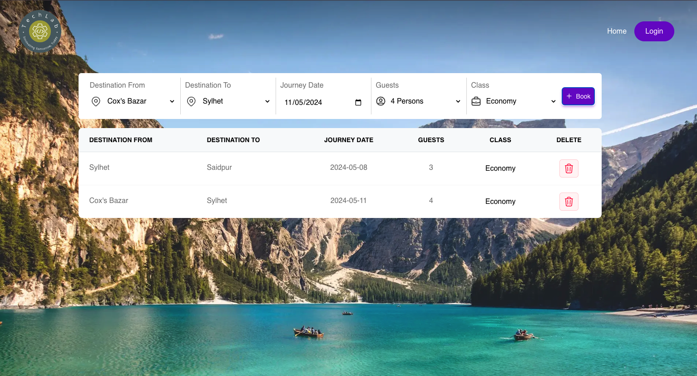

# TechLab | Flight Booking

This project is a practice application built using React and Redux core
concepts. It simulates a flight booking system with actions for booking and
canceling seats.

## Project Structure

- `src/`
     - `actions/`
          - `actionTypes.js`: Contains action type constants (`BOOK`,
            `CANCEL_BOOK`).
          - `bookingActions.js`: Action creators for booking and canceling
            seats.
     - `reducers/`
          - `bookingReducer.js`: Reducer function for managing booking lists.
     - `components/`: React components for the user interface.
     - `App.js`: Main component integrating Redux state management.
     - `index.js`: Entry point of the application.

## Available Actions

### Book Seat (`BOOK`)

- Action creator: `book_seat(data)`
- Payload structure:
     ```json
     {
     	"id": "unique_id",
     	"destination_from": "Source city",
     	"destination_to": "Destination city",
     	"date": "yyyy-mm-dd",
     	"person": "Person's name",
     	"class": "Economy/Business/First"
     }
     ```

````

### Cancel Booking (`CANCEL_BOOK`)

- Action creator: `cancel_book(id)`
- Payload: `id` of the booking to be canceled.

## Redux Reducer

The `bookingReducer` manages the `booking_lists` state, which stores information
about booked seats.

```javascript
import { BOOK, CANCEL_BOOK } from "./actionTypes";

const initial_state = {
	booking_lists: [],
};

const bookingReducer = (state = initial_state, action) => {
	switch (action.type) {
		case BOOK:
			return {
				...state,
				booking_lists: [
					...state.booking_lists,
					{
						id: action.payload.id,
						destination_from:
							action.payload
								.destination_from,
						destination_to:
							action.payload.destination_to,
						date: action.payload.date,
						person: action.payload.person,
						class: action.payload.class,
					},
				],
			};
		case CANCEL_BOOK:
			return {
				...state,
				booking_lists: state.booking_lists.filter(
					(list) => action.payload.id !== list.id
				),
			};
		default:
			return state;
	}
};

export default bookingReducer;
```

## Getting Started

1. Clone the repository:
   `git clone https://github.com/your-username/techlab-flight-booking.git`
2. Install dependencies: `npm install`
3. Start the development server: `npm start`

## Usage

- Use the provided actions to book and cancel seats.
- View and manage booking lists in the application.

## Technologies Used

- React
- Redux (core concepts)
- JavaScript (ES6+)

````

